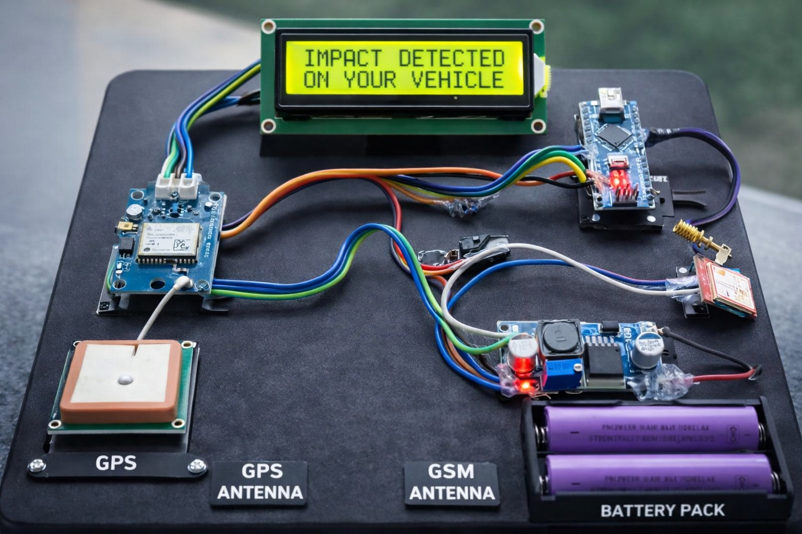
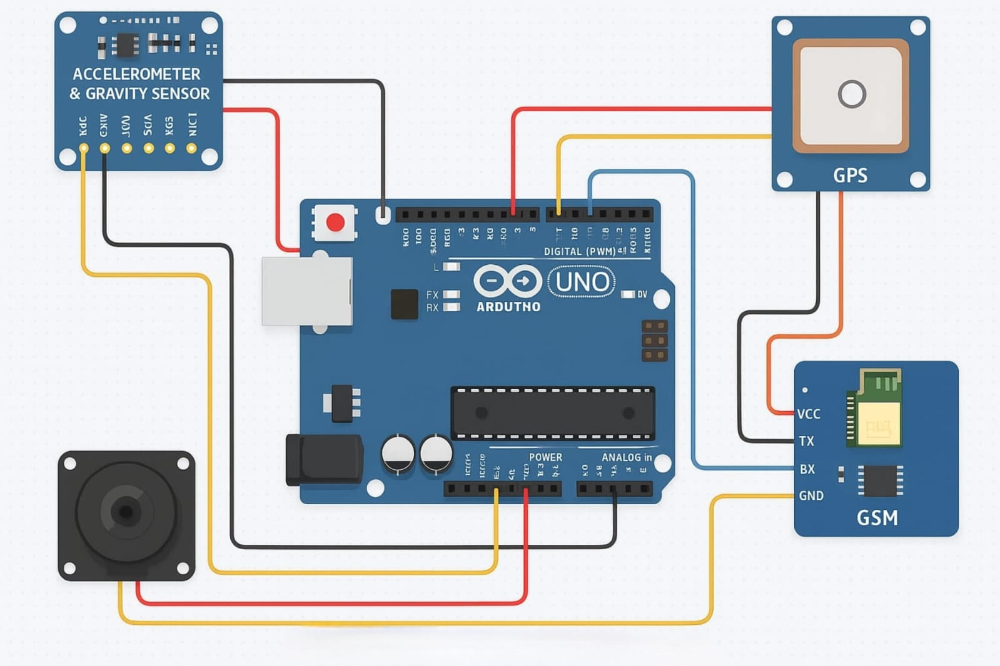
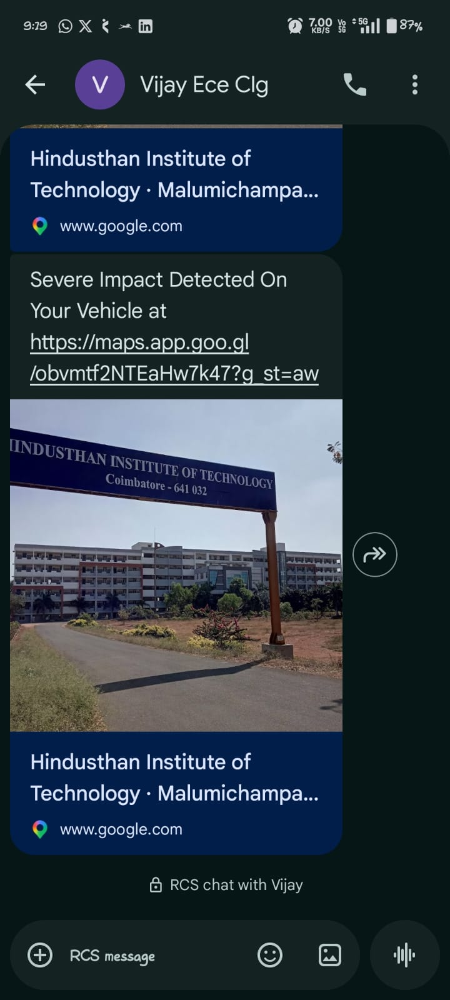

# HillNet Guardian – Smart GSM Rescue Alert

## Project Overview

HillNet Guardian is an embedded safety system designed to detect vehicle accidents and automatically send emergency alerts containing GPS coordinates through a GSM network.

The system uses an accelerometer to continuously monitor vehicle motion. When a sudden impact exceeding a predefined threshold is detected, an interrupt service routine is triggered. The GPS module obtains the current location and the GSM module sends an SMS alert to predefined emergency contacts.

---

## Features

- Real-time accident detection
- Interrupt-driven event handling
- GPS-based location tracking
- Automatic SMS alert transmission
- Fast emergency response
- Low-cost embedded implementation

---

## Hardware Components

Arduino UNO, ADXL335, NEO-6M (GPS), SIM800 (GSM), Power Supply

---

## Software Tools

- Arduino IDE
- Embedded C
- Serial Communication
- Interrupt Programming

---

## System Architecture

Accelerometer
↓
Arduino UNO
↓
GPS Module
↓
GSM Module
↓
Emergency SMS

---

## Working Principle

1. Accelerometer monitors vehicle movement.
2. Sudden impact is detected.
3. Interrupt Service Routine (ISR) executes.
4. GPS coordinates are acquired.
5. GSM module sends emergency SMS.
6. Emergency contact receives accident location.

---

## Results

- Successfully detected accident events.
- GPS coordinates acquired accurately.
- SMS alert delivered within approximately 10 seconds.

---

## Future Improvements

- IoT Cloud Integration
- Mobile Application
- Real-Time Tracking
- Multiple Emergency Contacts
- Voice Call Alerts

---

## Hardware Setup

## Circuit Diagram

## SMS Alert Output

## Project Documentation

- Project Presentation: [HillNet_Guardian_Presentation.pptx](document/HillNet_Guardian_Presentation.pptx)

## Author

Vijay T
